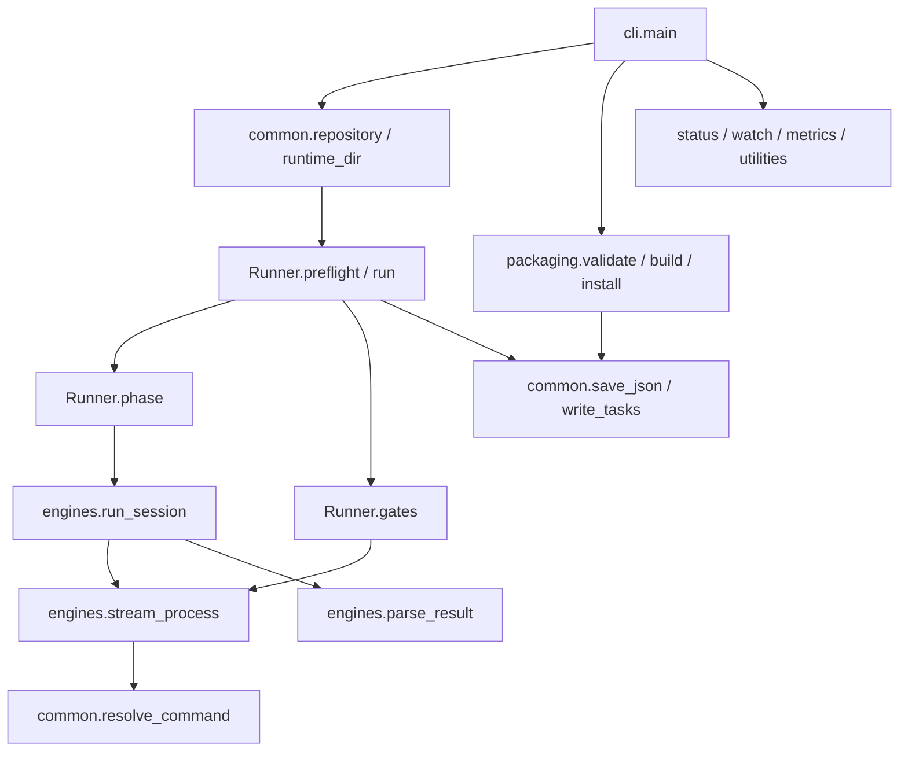

# Contexto arquitectónico del runtime Gara

Pase de contexto fechado el 30 de septiembre de 2026. Alcance principal: `gara_workflow/common.py`, `runner.py`, `engines.py`, `packaging.py` y `cli.py`. Se leyeron sus funciones relacionadas, los dos módulos de tests, el cliente simulado y los contratos documentados. Este documento registra comportamiento, invariantes condicionadas, supuestos y preguntas; no contiene veredictos ni recomendaciones de cambios.

El análisis usa registros agrupados del formato `ANALYSIS_FORMAT.md`: propósito, entradas, efectos, bloques, dependencias y preguntas. No se ejecutaron clientes de modelos, instalaciones, publicación, Linear, SSH, HPC ni pruebas en este pase. No se analizaron originales históricos ni assets. Las referencias de tests indican qué comprueban sus aserciones, no resultados de una ejecución nueva.

## Flujo y superficies de entrada

El mapa corresponde al despacho de [cli.py](../gara_workflow/cli.py) L169-L250, los imports y llamadas de [runner.py](../gara_workflow/runner.py) L12-L28, L272-L281 y L345-L347, y la cadena de [engines.py](../gara_workflow/engines.py) L234-L237. La entrada de checkout llama a `cli.main` después de añadir su raíz al import path; el helper instalado prefiere su runtime copiado: [scripts/gara_workflow.py](../scripts/gara_workflow.py) L7-L11 y [helper de la skill](../skills/gara-workflow/scripts/gara_workflow.py) L5-L10. El entry point empaquetado también es `gara_workflow.cli:main`: [pyproject.toml](../pyproject.toml) L16-L17.

| Entrada o estado | Confianza utilizada por el código | Comprobación observable |
| --- | --- | --- |
| Argumentos CLI y TOML | Operador con capacidad de elegir repo, cliente, configuración y destinos | Choices, tipos argparse y límites positivos; el TOML se carga sin un esquema global. [cli.py](../gara_workflow/cli.py) L26-L30, L122-L172 |
| Checkout, nombre y remotos Git | Identidad local de Gara | Git determina la raíz; se acepta nombre `gara` o remoto con ese segmento. No se consulta un propietario canónico. [common.py](../gara_workflow/common.py) L78-L89 |
| SPEC y TAREAS | Artefactos locales editables por usuario/agente | Marcadores y contrato estructural; el runtime guarda hashes después de cerrar las fases. [common.py](../gara_workflow/common.py) L119-L152; [runner.py](../gara_workflow/runner.py) L560-L568 |
| `state.json`, logs y manifiestos | Estado local usado como autoridad de reanudación o propiedad | JSON se carga y se contrastan campos concretos; no hay esquema integral previo. [runner.py](../gara_workflow/runner.py) L134-L171; [packaging.py](../gara_workflow/packaging.py) L123-L128, L253-L258 |
| Cliente Codex/Claude, Git y ejecutables de aceptación | Procesos externos con el entorno local | Resolución del ejecutable, códigos de salida y observaciones posteriores del checkout. [common.py](../gara_workflow/common.py) L63-L75, L302-L351; [engines.py](../gara_workflow/engines.py) L47-L110 |
| Catálogo, skills, roles y referencias del paquete | Fuentes del checkout del paquete | Validación de nombres y contenido seleccionado; generación desde estas fuentes. [packaging.py](../gara_workflow/packaging.py) L43-L107, L130-L194 |

## Registro: contratos y persistencia en `common.py`

**Propósito.** Proporcionar las rutas, identidad Git, contrato de artefactos, hashes y escritura que consumen Runner y packaging. `ROOT` deriva del archivo del runtime, no del checkout objetivo: [common.py](../gara_workflow/common.py) L16-L20, L31-L49, L78-L116.

**Entradas y supuestos.** Repo y slug proceden de CLI/Runner; nombres de archivos, cwd y argv proceden del JSON de tareas. Su tratamiento es semiconfiable: se valida forma y pertenencia antes de usarlos. `approved: true` se toma como registro de autorización; prueba independiente de que el usuario autorizó esa versión: `nothing found` en `specification`, que solo lee el documento. [common.py](../gara_workflow/common.py) L92-L109, L112-L138, L155-L238; contrato humano en [artifacts.md](../references/artifacts.md) L16-L18.

**Salidas y efectos.** `inside` devuelve la ruta resuelta; `specification` devuelve issue y conjunto de requisitos; `read_tasks` devuelve un dict validado. `save_json` y `write_tasks` escriben mediante reemplazo de un archivo temporal en el mismo directorio; el contenido temporal se vacía y se sincroniza antes de `os.replace`. No hay transacción de varios archivos. [common.py](../gara_workflow/common.py) L31-L45, L106-L109, L138-L152, L281-L299.

**Bloques y dependencias.**

| Bloque | Qué establece y por qué precede al consumidor | Dependientes y límites |
| --- | --- | --- |
| Rutas, L92-L116 | Rechaza rutas vacías, caracteres enumerados, absolutos, `..`, `.git` y escapes tras resolver; valida el slug antes de pedir su git-path | Contratos, hashes, generación e instalación dependen de esta pertenencia al momento de la llamada. No fija la estructura del filesystem durante operaciones posteriores. |
| SPEC y lectura, L119-L152 | Exige archivo, frontmatter con `approved: true`, issue `GAR-N`, requisitos `R1...` y ausencia de encabezado bloqueante; después extrae y valida JSON | `Runner.preflight` obtiene aquí su identidad y requisitos. Se busca el primer bloque de tareas. |
| Tareas y horario, L155-L278 | Exige IDs únicos, referencias existentes y cobertura de requisitos, briefing, estados, tipos de checkpoint/peso, archivos concretos, aceptación y timeout; después verifica programación única, dependencias en tandas anteriores, máximo tres tareas, sin rutas solapadas por tanda y carga máxima cuatro | Runner recibe un horario estructuralmente válido. La suficiencia semántica del briefing o de la prueba no se deriva de estas comprobaciones. |
| Huella y escritura, L281-L299 | La huella incluye el contrato salvo `status` y `evidence` de cada tarea; la escritura sustituye el primer bloque | Reanudación puede cambiar estados/evidencia conservando el contrato cerrado. La unicidad del bloque en todo el documento no se comprueba aquí. |
| Resolución, L302-L351 | Python prefiere una venv local o el intérprete del runtime; `.py` se lanza con Python; wrappers de shell conocidos se traducen a Node y otros se bloquean | `stream_process` y `doctor` reciben una lista argv. El nombre de un ejecutable no autentica su contenido ni la configuración del cliente. |

Referencias de la tabla: [common.py](../gara_workflow/common.py) L92-L152, L155-L299, L302-L351. `redact` sustituye tres familias de patrones concretos; no es un clasificador general de secretos: [common.py](../gara_workflow/common.py) L52-L60.

**Dependencias cruzadas.** `git` es una llamada externa y reporta errores cuando `check=True`; sin esa opción devuelve stdout aunque haya fallado. `repository`, `runtime_dir` y Runner dependen del significado de las respuestas de Git. `digest` lee bytes del archivo; `file_hashes` de Runner representa con `None` rutas que no son archivos. [common.py](../gara_workflow/common.py) L48-L49, L63-L89, L112-L116; [runner.py](../gara_workflow/runner.py) L37-L41.

**Preguntas abiertas.** ¿Quién puede escribir SPEC/TAREAS y con qué revisión previa de argv? ¿El contrato exige un único bloque de tareas y rutas con una representación canónica única? ¿La identidad raíz/remoto es la identidad operativa suficiente? Las comprobaciones observadas son L78-L89, L119-L152 y L221-L238 del mismo módulo; para esas garantías adicionales: `nothing found` en este alcance.

## Registro: ciclo de ejecución en `runner.py`

**Propósito.** Coordinar `plan → tasks → build → verify → review`, commits y publicación opcional, separando mensajes del cliente de aceptación ejecutada por el coordinador. [runner.py](../gara_workflow/runner.py) L513-L633.

**Entradas y supuestos.** Repo/slug/motor identifican una ejecución; config y client llegan de CLI. Artefactos están en `specs/<slug>/`; estado y lock se calculan con el git-path `gara-workflow/<slug>`. `skill_path` selecciona primero la skill del home del motor, luego la ubicación legacy de Codex y finalmente fallbacks del paquete; solo exige que exista el archivo. [runner.py](../gara_workflow/runner.py) L76-L116; [common.py](../gara_workflow/common.py) L112-L116.

**Salidas y efectos.** Se escriben estado y logs en runtime, estados/evidencia en TAREAS, y se entregan prompts a clientes capaces de editar y hacer commits. `save` registra HEAD actual, fecha y razón redactada. `phase` observa la rama, hashes y cambios después de la sesión; no impide la escritura antes de observarla. [runner.py](../gara_workflow/runner.py) L225-L233, L261-L327, L329-L395.

**Bloques y dependencias.**

| Bloque | Qué establece | Dependientes y supuestos |
| --- | --- | --- |
| `preflight`, L118-L217 | SPEC válida, rama no principal/no detached y substring del issue en su nombre; en reanudación compara repo, rama, issue, motor, hashes y ascendencia de HEAD; en inicio rechaza cambios ajenos a artefactos | La identidad y hashes del estado local se usan como referencia. Si hay TAREAS, valida su contrato, prohíbe asignar nombres de artefactos y compara cambios desde `base_head` contra todos los archivos permitidos. |
| `run` y `flow_lock`, L45-L73, L521-L547 | `dry_run` retorna antes de crear lock/estado o ejecutar modelos; ejecución real vuelve a comprobar preflight bajo lock | El archivo es `self.runtime / flow.lock`: exclusión por checkout/git-path y slug. No es un lock común para todos los slugs ni para packaging. |
| `phase`, L261-L327 | Antes de aceptar completed, compara rama, SPEC, PLAN cerrado y cambios fuera de `allowed`; un fallo de infraestructura solo reintenta si hashes de cambios y HEAD siguen iguales | Depende del conjunto que devuelve `changes`: diff de Git contra base más untracked no ignorados, L31-L34. Las comprobaciones son posteriores y no equivalen a aislamiento del proceso. |
| `gates`, L329-L395 | Ejecuta cada argv, registra salida/código/tiempo, contrasta cambios e historial, hashes de SPEC/PLAN y huella de TAREAS; solo con códigos cero termina en `verified` y guarda hashes de archivos | El conjunto permitido aquí incluye todos los artefactos y archivos de todas las tareas, aunque se valide una selección. Depende de que la aceptación mida lo exigido por los requisitos. |
| `build` y `commit`, L397-L511 | Hashes ausentes o diferentes invalidan verified y fases posteriores; tareas running se contrastan antes de repetir autor; commit compara bytes de implementación, huella y ausencia de cambios permitidos pendientes | El cliente recibe la instrucción de usar `gara-commit`; no hay llamada directa al validador desde Runner. El coordinador observa efectos Git y archivos, no la herramienta concreta invocada. |
| Verificación/revisión, L576-L614 | Cada fase pendiente se ejecuta; después el coordinador vuelve a correr toda la aceptación, exige que exista REVISION y delega commit | Independencia del revisor, contenido suficiente o SHA de REVISION no tienen una comprobación estructural aquí. |
| Publicación, L615-L650 | Solo se programa con `publish=True`; tras la sesión exige ENTREGA con regex de URL GitHub de `gara/pull/N` y texto `In Review` | `allowed` proviene de L573-L575: cinco artefactos más archivos de todas las tareas. Entre esa sesión y el cierre no se añade una nueva llamada a gates, comparación de huella de tareas ni commit. El prompt solicita URL, SHA y estado observado; el cierre comprueba los dos marcadores textuales. |

Referencias de la tabla: [runner.py](../gara_workflow/runner.py) L31-L73, L118-L217, L261-L511 y L513-L650.

**Dependencias cruzadas.** `phase` confía en `run_session` para el resultado normalizado; `gates` usa el mismo ejecutor de procesos sin protocolo de modelo; `commit` usa `phase`. El lock del sistema operativo se libera al salir del contexto; `Blocked` y fallos previstos dentro del tramo protegido se guardan en estado antes de propagarse. [runner.py](../gara_workflow/runner.py) L44-L73, L272-L281, L345-L347, L402-L413, L634-L642.

**Subagentes observados.** El prompt pide subagentes nativos permitidos, hasta tres trabajadores, o ejecución secuencial declarada. El coordinador registra sesión principal, estado y usage del cliente; `parse_result` conserva mensajes del agente/resultados y no un inventario de eventos de subagentes. No hay comprobación independiente del número, identidad, reparto, independencia ni uso efectivo de subagentes: `nothing found`. [runner.py](../gara_workflow/runner.py) L247-L251, L282-L291; [engines.py](../gara_workflow/engines.py) L113-L159, L234-L237. Los tests usan un proceso fixture que ejecuta cada fase: [fake_client.py](../tests/fixtures/fake_client.py) L12-L19, L79-L189.

**Preguntas abiertas.** ¿Se admite trabajo simultáneo en dos slugs del mismo checkout? ¿Qué operaciones del cliente se consideran dentro del alcance además de los archivos observados por Git? ¿Qué evidencia externa establece asignación/criterios vigentes, revisión humana y publicación real? ¿Se espera que publish pueda modificar los archivos de implementación permitidos? Las zonas que materializan estas decisiones son L45-L73, L235-L259, L301-L311 y L615-L650.

## Registro: procesos y protocolo en `engines.py`

**Propósito.** Ejecutar los clientes nativos y aceptación con argv literal, acotar tiempos y convertir stream JSON a `Result`. [engines.py](../gara_workflow/engines.py) L20-L26, L47-L110, L113-L238.

**Entradas y supuestos.** Prompt, cwd, ejecutable y args llegan de Runner/config; `run_session` valida lista de strings y rechaza tres flags exactos de bypass. El cliente es una dependencia externa: versión, autenticación, semántica de argumentos y cumplimiento del prompt no se establecen aquí. Los procesos heredan `os.environ`, con `PYTHONIOENCODING=utf-8`; no se crea un entorno reducido. [engines.py](../gara_workflow/engines.py) L55-L67, L206-L234.

**Salidas y efectos.** `stream_process` crea un grupo/sesión de proceso, escribe stdin y drena stdout/stderr en threads; conserva últimas 10.000 líneas stdout y 1.000 stderr, y devuelve hasta 12.000 caracteres stderr. Timeout u otra excepción intenta terminar el árbol/grupo propio. `run_session` guarda solo el `Result` normalizado. [engines.py](../gara_workflow/engines.py) L29-L110, L234-L237.

**Bloques y dependencias.**

| Bloque | Qué establece y consumidor | Supuestos restantes |
| --- | --- | --- |
| Proceso, L47-L110 | Popen recibe argv resuelto sin `shell=True`; lectura concurrente y timeout evitan esperar indefinidamente por el cierre de los pipes; excepción llama a `stop_owned_process` | El executable y código invocado tienen las capacidades de su entorno. El tamaño se acota por número de líneas conservadas, no por tamaño de cada línea. |
| Parseo, L113-L159 | Ignora líneas no JSON y eventos no dict; Codex necesita `turn.completed`, Claude un `result`; recoge mensajes, session y usage | Hay comprobaciones de objetos externos, pero no un esquema completo de todos sus campos internos. `item.text`, IDs y usage siguen la forma que entregue el cliente. |
| Resultado, L160-L192 | Bloqueo/denegación/auth preceden al cierre; código no cero, fallo o ausencia de cierre producen failed; éxito requiere marca explícita completed además del cierre | La marca procede del texto del cliente. El parser no verifica por sí mismo los artefactos ni la aceptación. Infraestructura se clasifica por expresiones en el resumen. |
| Sesión, L195-L238 | Construye argv distinto por motor, envía prompt por stdin, parsea y guarda dataclass | La redacción se aplica al resumen; session_id y usage se guardan como metadatos entregados por el cliente. |

Referencias de la tabla: [engines.py](../gara_workflow/engines.py) L29-L238; [common.py](../gara_workflow/common.py) L302-L351.

**Dependencias cruzadas.** `resolve_command` decide qué programa se ejecuta; `save_json` decide la persistencia del resultado. `stop_owned_process` usa `taskkill /PID /T /F` en Windows o señales al grupo en POSIX; las garantías efectivas de esas llamadas dependen del sistema operativo. También `pdf.render` usa `stream_process` para el navegador: [engines.py](../gara_workflow/engines.py) L29-L44, L56-L67, L234-L237; [pdf.py](../gara_workflow/pdf.py) L123-L143.

**Preguntas abiertas.** ¿Qué versiones/formas del protocolo son admitidas, incluido el tipo de mensajes/usage? ¿Qué metadatos pueden contener datos sensibles fuera del resumen? ¿Qué evidencia se exige de terminación de descendientes? Compatibilidad y autenticación se describen como heredadas del cliente en [runtime.md](../references/runtime.md) L34-L36; verificación integral de estas propiedades: `nothing found` en este módulo.

## Registro: distribución e instalación en `packaging.py`

**Propósito.** Validar fuentes del paquete, generar distribuciones nativas para Codex y Claude e instalar archivos gestionados mediante hashes. [packaging.py](../gara_workflow/packaging.py) L43-L107, L110-L230, L233-L323.

**Entradas y supuestos.** root proviene de `ROOT`; destino y home pueden elegirse por CLI. Catálogo y manifiestos existentes se usan como fuentes locales confiadas. `validate` comprueba nombres/identidad de skills, cuerpo, referencias existentes, compilación sintáctica de scripts, correspondencia de carpetas, existencia de roles y cobertura del export; no hay esquema completo del catálogo/manifiesto ni prueba de procedencia de sus bytes. [cli.py](../gara_workflow/cli.py) L175-L185; [packaging.py](../gara_workflow/packaging.py) L43-L107, L123-L128, L253-L258.

**Salidas y efectos.** build forma payload en memoria para ambos motores, comprueba colisiones, escribe archivos y retira obsoletos del manifiesto anterior; al final escribe `.gara-build.json`. install vuelve a construir `root/.build`, comprueba colisiones en home antes de escribir allí y actualiza `.gara-workflow/installation.json`. Las escrituras del conjunto no son una transacción; el manifiesto sí usa `save_json`. [packaging.py](../gara_workflow/packaging.py) L129-L224, L251-L314; [common.py](../gara_workflow/common.py) L31-L45.

**Bloques y dependencias.**

| Bloque | Qué establece | Dependientes y límites |
| --- | --- | --- |
| `frontmatter`/`header`, L14-L40 | Parser de campos escalares línea a línea, usando JSON cuando se puede; emisor produce valores JSON en frontmatter | Validación/generación dependen de este formato concreto, no de un parser YAML general. |
| `validate`, L43-L107 | Skills tienen nombre válido único, descripción y cuerpo; rutas de Markdown existen y scripts compilan; catálogo cubre carpetas/export | La existencia de un link no demuestra pertenencia a la raíz; campos de agentes se consumen después en build. |
| Generación, L110-L194 | Restringe destino frente a raíces enumeradas; incorpora referencias canónicas y runtime en tres helpers; Codex genera TOML y YAML, Claude frontmatter/model inherit | Los nombres y fuentes de roles vienen del catálogo. El runtime copiado no depende de importar el checkout original. |
| Preflight de build, L195-L224 | Rechaza destino ajeno con contenido distinto, archivos gestionados editados y obsoletos editados antes del primer write | Confía en el manifiesto previo para decidir propiedad. Entre comprobación y escritura se usa de nuevo el filesystem. |
| install, L233-L323 | Motor válido; dry_run retorna antes de build/write; legacy gara-commit de Codex se reutiliza; colisiones en home se acumulan antes de escribir; contenido idéntico no se vuelve a escribir | Un archivo igual al payload o al hash previo se acepta. install incorpora hashes previos y no tiene el barrido de obsoletos de build. La exclusión de colisiones en home no evita que `.build` ya haya cambiado. |

Referencias de la tabla: [packaging.py](../gara_workflow/packaging.py) L14-L323.

**Dependencias cruzadas.** `inside` limita los destinos payload al root elegido; `digest` y SHA256 del contenido comparan versiones; `save_json` reemplaza el manifiesto final. `build` llama otra vez a `validate`. La skill legacy se acepta por existencia de su `SKILL.md`, sin contrastar equivalencia con la versión del paquete. [packaging.py](../gara_workflow/packaging.py) L110-L112, L197-L224, L268-L290, L299-L314.

**Preguntas abiertas.** ¿Quién puede modificar los manifiestos usados como registro de propiedad? ¿Se permiten build/install concurrentes y qué sucede ante interrupción entre payload y manifiesto? ¿Cuál es la política para archivos retirados de una instalación o equivalencia de gara-commit legacy? No hay lock o rollback del conjunto en L110-L323; esas garantías adicionales tienen `nothing found` en este alcance.

## Registro: despacho e inspección en `cli.py`

**Propósito.** Elegir rutas de ejecución y entregar JSON con códigos de salida diferenciados; exponer diagnósticos y lecturas locales. [cli.py](../gara_workflow/cli.py) L116-L273.

**Entradas y supuestos.** El operador selecciona TOML/cliente/paths y flags. `both` se acepta para instalar y se rechaza al ejecutar. resume exige un estado previo, pero usa el mismo `Runner.run` que run. [cli.py](../gara_workflow/cli.py) L138-L172, L208-L233.

**Salidas y efectos.** `doctor` ejecuta `--version` de cada cliente y devuelve información de disponibilidad; no acredita autenticación. `metrics` suma valores numéricos de usage en logs con status. status/watch leen estado local; `watch --host` delega a lectura SSH explícita; fixes puede escribir su salida si se elige destination. [cli.py](../gara_workflow/cli.py) L33-L113, L187-L204, L234-L250; [utilities.py](../gara_workflow/utilities.py) L15-L41, L59-L95.

**Bloques y dependencias.** La configuración se carga antes del despacho. validate/package/install usan `ROOT` sin requerir repo Gara; los demás comandos locales normalizan el repo, y los de ejecución/estado exigen slug. Un resultado retornado imprime JSON y devuelve 0; excepciones Blocked, fallos previstos e interrupción producen 2, 1 y 130 respectivamente. [cli.py](../gara_workflow/cli.py) L169-L273. Las lecturas de estado/logs confían en su JSON sin reutilizar la reconciliación de `Runner.preflight`: L94-L113, L234-L250.

**Dependencias cruzadas.** doctor usa `resolve_command` y `pdf.find_browser`, cuya selección observa archivos disponibles. sessions enumera filas del estado del ejecutor; health consume metrics y deja explícito que contadores no prueban suficiencia ni revisión humana. [cli.py](../gara_workflow/cli.py) L34-L70; [pdf.py](../gara_workflow/pdf.py) L19-L56; [utilities.py](../gara_workflow/utilities.py) L44-L56; [health.py](../gara_workflow/health.py) L19-L50.

**Preguntas abiertas.** ¿Se espera que el estado leído por status/watch sea autoritativo aunque no se haya reconciliado con HEAD? ¿Qué errores de estructura de TOML/JSON forman parte de las salidas soportadas? El conjunto de excepciones capturadas está en L253-L273; validación completa de estructura: `nothing found` en configuration/metrics/lectura de estado.

## Invariantes contrastadas con tests leídos

| Invariante condicionada del código | Evidencia de tests |
| --- | --- |
| Rutas del contrato no escapan y la forma del horario/cobertura se valida | [test_workflow.py](../tests/test_workflow.py) L53-L125: duplicados, dependencias inexistentes/en la misma tanda, colisiones, carga, requisito sin cubrir, aceptación vacía y tipos anidados |
| Status/evidence no alteran la huella; briefing sí | [test_workflow.py](../tests/test_workflow.py) L127-L133 |
| Cierre proveedor y marca explícita son distintos requisitos; denegación/auth bloquean | [test_workflow.py](../tests/test_workflow.py) L137-L194 |
| argv se pasa literalmente; el timeout da Blocked | [test_workflow.py](../tests/test_workflow.py) L203-L215; el segundo test no afirma por separado terminación de todo descendiente ni supervivencia de un proceso ajeno |
| Aceptación se ejecuta por el coordinador, y mensaje de éxito no sustituye aceptación/commit | [test_workflow.py](../tests/test_workflow.py) L268-L277, L357-L385 |
| Inicio ajeno/principal, checkpoint, contrato cambiado y regresión de review siguen rutas diferenciadas | [test_workflow.py](../tests/test_workflow.py) L293-L313, L376-L379, L399-L407 |
| Reanudación contrasta hashes y recuperación/retry depende de efectos observados | [test_workflow.py](../tests/test_workflow.py) L315-L355 |
| La misma ruta de lock no se obtiene dos veces y puede liberarse/reutilizarse | [test_workflow.py](../tests/test_workflow.py) L409-L415; no cubre dos slugs diferentes |
| dry_run de ejecución e instalación no escriben ni llaman al cliente | [test_workflow.py](../tests/test_workflow.py) L287-L291; [test_packaging.py](../tests/test_packaging.py) L92-L96 |
| Metadata nativa, idempotencia, colisiones y preservación de edición/legacy son comprobaciones existentes | [test_packaging.py](../tests/test_packaging.py) L26-L96, L113-L124 |
| Helper instalado puede importar runtime y ejecutar doctor desde su home | [test_packaging.py](../tests/test_packaging.py) L98-L111; no valida por sí mismo la ejecución real de fases con servicios externos |

Los tests de flujo fuerzan `client=tests/fixtures/fake_client.py`, crean un repo temporal y configuran modos deterministas. El fake commit usa Git directamente; el fake publish solo escribe ENTREGA. Por tanto, estos tests no acreditan uso real de gara-commit, subagentes, Linear o una PR externa. [test_workflow.py](../tests/test_workflow.py) L219-L251; [fake_client.py](../tests/fixtures/fake_client.py) L155-L189. El validador real tiene su propio análisis de staging y generación de mensaje, y solo al final llama a Git commit: [gara_commit.py](../skills/gara-commit/scripts/gara_commit.py) L188-L225, L275-L308.

## Supuestos pendientes para el pase posterior

| Supuesto | Lo que sí lo establece | Garantía adicional no encontrada |
| --- | --- | --- |
| Autorización real/issue asignado/criterios vigentes | Marcador SPEC y prompt del cliente. [common.py](../gara_workflow/common.py) L123-L138; [runner.py](../gara_workflow/runner.py) L245-L253 | Validación independiente del servicio o de la autorización: `nothing found` |
| Pruebas adecuadas al requisito | Cobertura por referencia y argv no vacío. [common.py](../gara_workflow/common.py) L182-L189, L218-L240 | Suficiencia semántica y ausencia de cambios en las pruebas para declarar verde: `nothing found` como propiedad estructural general |
| Filesystem/Git estables durante observación y escritura | Rutas resueltas y hashes a puntos concretos. [common.py](../gara_workflow/common.py) L106-L109; [runner.py](../gara_workflow/runner.py) L264-L305 | Aislamiento frente a cambios externos, ignorados o fuera del checkout: `nothing found` |
| JSON local íntegro y confiable | Campos y hashes específicos de reanudación/propiedad. [runner.py](../gara_workflow/runner.py) L134-L171; [packaging.py](../gara_workflow/packaging.py) L124-L128, L254-L258 | Esquema completo/autenticación del estado o manifiestos: `nothing found` |
| Cliente y estructura de sus eventos conformes | argv y eventos exteriores seleccionados. [engines.py](../gara_workflow/engines.py) L113-L159, L206-L234 | Conformidad de todos los campos/flags y de sus efectos: `nothing found` |
| Revisión independiente y delegación efectiva | Instrucciones y existencia de REVISION. [runner.py](../gara_workflow/runner.py) L247-L251, L603-L606 | Inventario/verificación de subagentes y revisión humana: `nothing found` |
| Publicación observada externamente | Resultado del cliente y URL/texto en ENTREGA. [runner.py](../gara_workflow/runner.py) L615-L650 | Consulta independiente de PR, SHA y estado Linear: `nothing found` |
| Escritura del conjunto build/install completa y sin concurrencia | Preflight de colisiones y manifiesto final. [packaging.py](../gara_workflow/packaging.py) L195-L224, L283-L314 | Lock o transacción/rollback del conjunto: `nothing found` |

Las zonas con más acoplamiento son contrato/huella/reanudación, selección de alcance por fase, lifecycle de procesos/protocolo y confianza en manifiestos. Sus puntos de entrada y salida quedan enlazados arriba para que el siguiente pase contraste cada supuesto con el comportamiento que requiera el producto.
